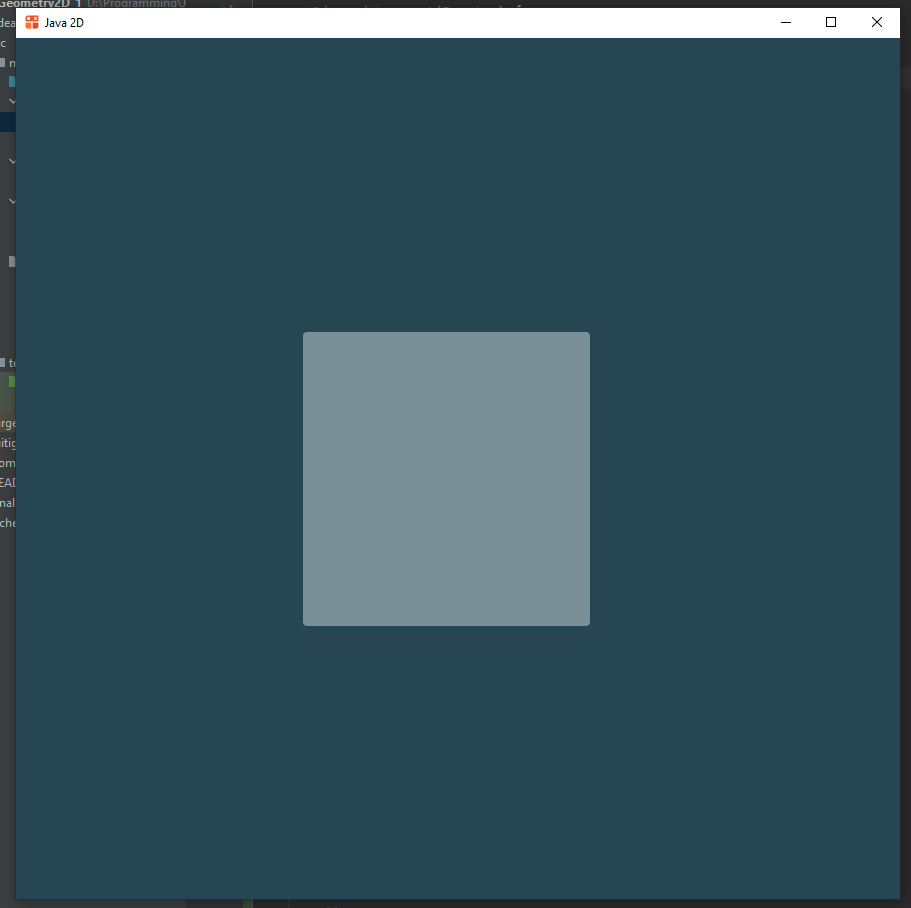

# Java 2D

Это пример использования библиотеки JWM.
Репозиторий этой библиотеки [здесь](https://github.com/HumbleUI/JWM).

Она использует Skija библиотеку для 2D рисования, её репозиторий
[здесь](https://github.com/JetBrains/skija).

Главный класс - это `app.Application`. Он рисует панели, каждая из которых
определена в отдельном классе.

Чтобы запустить javaDoc, нужно указать кодировку

`-encoding UTF-8 -charset UTF-8 -docencoding UTF-8`

